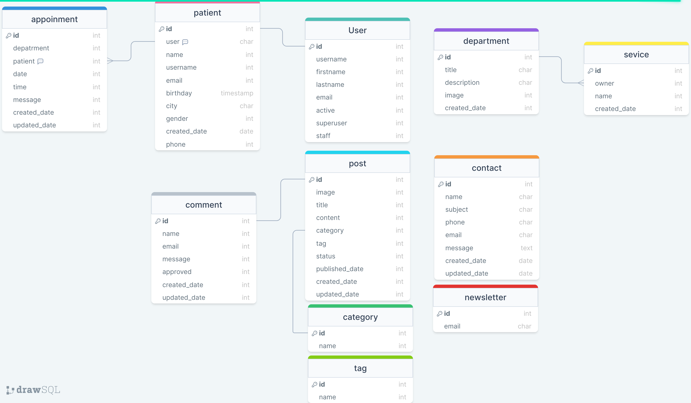

# HealthCare

## Features 
- Blog
- Patient Profile
- Make Appointment 

## Instalation
> 1. clone repo 
> 2. create virtual enviroment and activate
>     - python -m venv venv
>     - venv\Scripts\activate (Windows)
>     - source venv/bin/activate (Linux & Mac)
> 3. cd into project
> 4. pip install -r requirements.txt

## Run Project

deployment settings
`python manage.py runserver 0.0.0.0:8000 --settings=mysite.setting.dev`

production settings
`python manage.py runserver 0.0.0.0:8000 --settings=mysite.setting.prod`

## Model Schema

